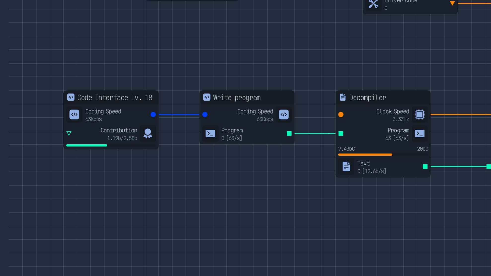

# Write programs node Upload Labs

## Description

Adds a new nodes allowing you to use code speed to write programs

## Installation

Add the .zip file from the latest release in your games /mods folder.

## Requirement

You need to have the godot modloader setuped on your game.

More info at [Mod loader self setup](https://wiki.godotmodding.com/guides/integration/mod_loader_self_setup/)
